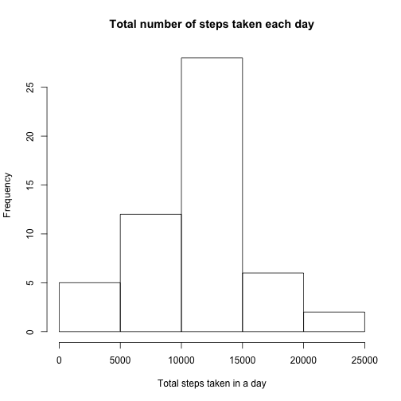
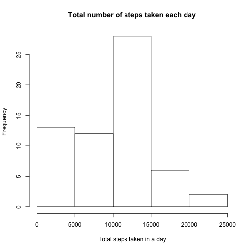
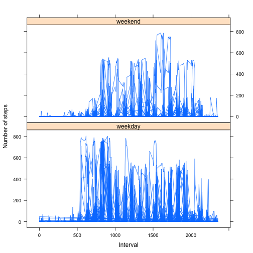

# Reproducible Research: Peer Assessment 1


## Loading and preprocessing the data


```r
if( !file.exists( 'activity.csv' ) )
{
  if( !file.exists( 'activity.zip' ) )
  {
    zip_url <-
      'https://d396qusza40orc.cloudfront.net/repdata%2Fdata%2Factivity.zip'
    download.file( zip_url, 'activity.zip', method='curl')
  }
  unzip( 'activity.zip' )
}
activity <- read.csv( 'activity.csv' )
activity$day_of_week <- factor( weekdays( as.Date( activity$date ) ) )
# new factor variable in the dataset with two levels – “weekday” and “weekend”
# indicating whether a given date is a weekday or weekend day.
activity$day_type <-
  factor( ifelse( activity$day_of_week == 'Saturday'
                    | activity$day_of_week == 'Sunday',
                  'weekend', 'weekday' ) )
number_of_days <- length( unique( activity$date ) )
```

## What is mean total number of steps taken per day?

The most common number of steps taken in a day is 10,000 to 15,000. This occurs
on more than 25 days (~41% of the time).


```r
total_steps_per_day <-
  aggregate( steps ~ date, data=activity, FUN=sum, na.omit=TRUE )
hist( total_steps_per_day$steps, xlab='Total steps taken in a day',
      main='Total number of steps taken each day' )
```

 

```r
mean( total_steps_per_day$steps )
```

```
## [1] 10767
```

```r
median( total_steps_per_day$steps )
```

```
## [1] 10766
```

## What is the average daily activity pattern?

Although there are spikes throughout the day, the largest spike in activity
occurs between intervals 500 and 1000.


```r
steps_per_interval <-
  aggregate( steps ~ interval, data=activity, FUN=mean, na.omit=TRUE )
plot( steps ~ interval, data=steps_per_interval, type='l' )
```

 

5-minute interval with the maximum average number of steps per day:


```r
steps_per_interval[ steps_per_interval$steps==max( steps_per_interval$steps ),
                    'interval' ]
```

```
## [1] 835
```

## Imputing missing values

1) Total number of missing values in the dataset:


```r
nrow( activity[ is.na( activity$steps ), ] )
```

```
## [1] 2304
```

2) Strategy for filling in all of the missing values in the dataset:


```r
intervals <- unique( activity$interval )
impute <- function( interval )
{
  # median should be less sensitive to outliers
  # round the value to be consistent with the intervals for which data is
  # provided
  round( median( activity[ activity$interval==interval, 'steps' ],
                 na.rm=TRUE ) )
}
imputed_steps_per_interval <-
  data.frame( interval = intervals,
              steps = sapply( intervals, impute ) )
```

3) New dataset that is equal to the original dataset but with the missing data
filled in:


```r
imputed <- activity
imputed[ is.na( activity$steps ), 'steps' ] <-
  merge( imputed[ is.na( imputed$steps ), ][ 'interval' ],
         imputed_steps_per_interval,
         by.x='interval', by.y='interval' )$steps
```

4) Impact of imputation:

After imputation, the average and median total steps taken in a day both go down.
In addition, it is now much more common to see between 0 and 5,000 steps taken
in a day. With the original data set, there were only 5 days on which this
occured (~8%). However, after imputation,
this happens between 10 and 15 times (~16 -
25%).


```r
total_steps_per_day <-
  aggregate( steps ~ date, data=imputed, FUN=sum )
hist( total_steps_per_day$steps, xlab='Total steps taken in a day',
      main='Total number of steps taken each day' )
```

 

```r
mean( total_steps_per_day$steps )
```

```
## [1] 9504
```

```r
median( total_steps_per_day$steps )
```

```
## [1] 10395
```

## Are there differences in activity patterns between weekdays and weekends?

Although the level of activity on weekends versus weekdays are comparable, there
are notable differences in the patterns. Activity starts earlier on weekdays. In
addition, weekends see a spike after interval 1500 that is not as pronounced on
weekdays.


```r
average_steps_per_interval <-
  aggregate( steps~interval + day_type, data=activity, FUN=mean )
library( lattice )
xyplot( steps~interval | day_type, data=activity, layout=c( 1, 2 ), type='l',
        xlab='Interval', ylab='Number of steps' )
```

 
